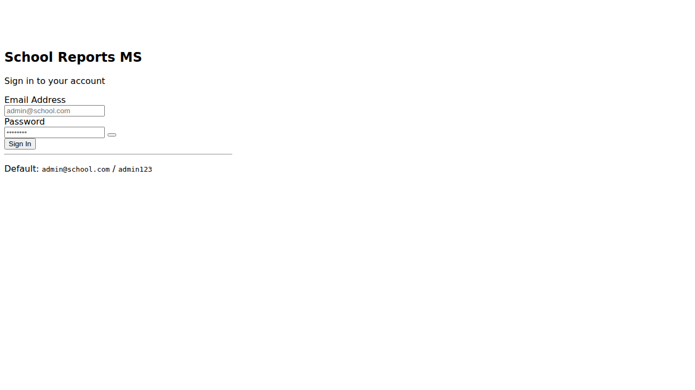
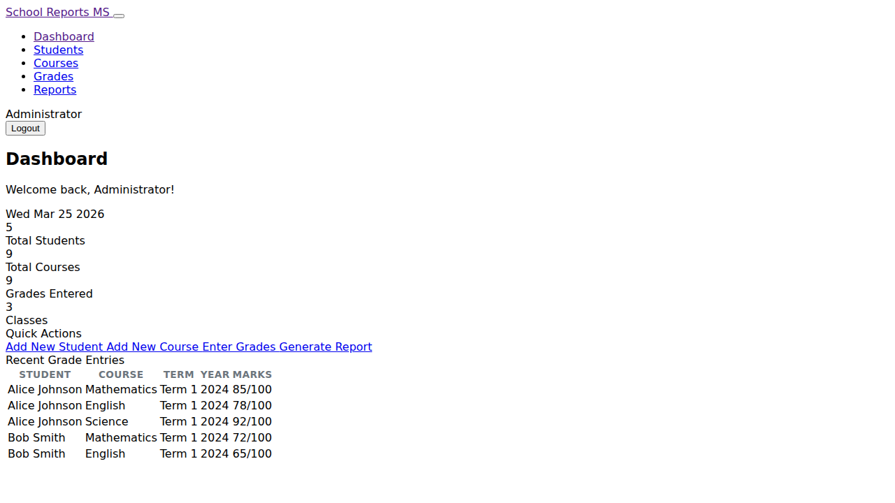
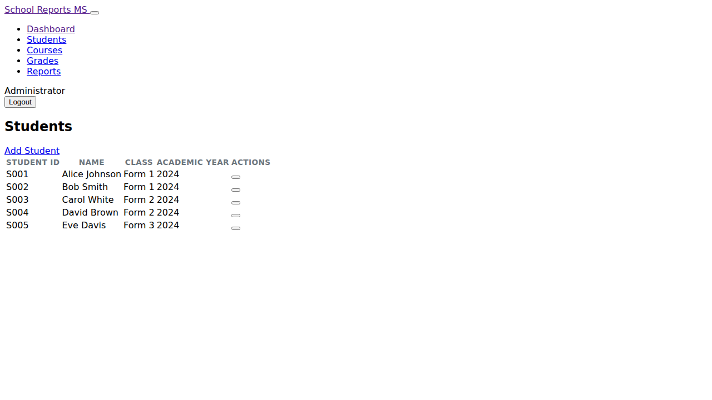
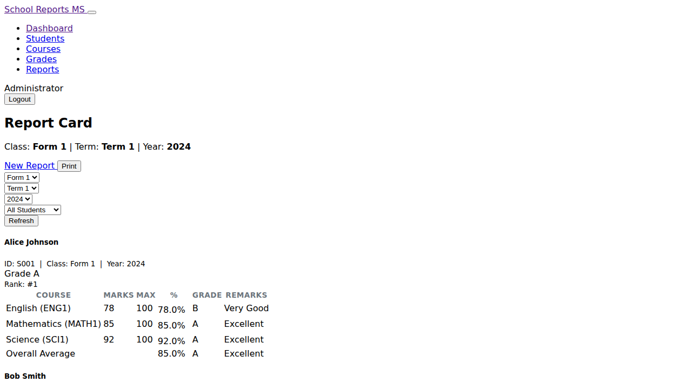

# School Reports Management System

A web-based system designed to manage student reports by term and academic year. It generates per-course, per-term, and annual report cards with grades and class rankings.

## Features

- **Authentication** — Secure login with role-based access
- **Student Management** — Add, edit and delete students per class and year
- **Course Management** — Manage courses per class, optionally assigned to a teacher
- **Grade Entry** — Record marks per student, course, term and year (upserts on re-entry)
- **Report Generation** — Generate report cards showing marks, percentage, grade (A–F), remarks and class rank; supports Term 1/2/3 and Annual (averaged across all terms)
- **Print-friendly** — Reports include a Print button with dedicated print CSS

## Quick Start

```bash
npm install
npm start
```

Open [http://localhost:3000](http://localhost:3000) in your browser.

**Default credentials:** `admin@school.com` / `admin123`

## Screenshots

### Login


### Dashboard


### Students


### Report Card


## Tech Stack

- **Backend:** Node.js + Express
- **Database:** SQLite (via better-sqlite3)
- **Templating:** EJS
- **UI:** Bootstrap 5 + Bootstrap Icons
- **Auth:** bcryptjs + express-session

## Grading Scale

| Grade | Percentage | Remarks  |
|-------|-----------|----------|
| A     | ≥ 80%     | Excellent |
| B     | 70–79%    | Very Good |
| C     | 60–69%    | Good      |
| D     | 50–59%    | Pass      |
| F     | < 50%     | Fail      |
